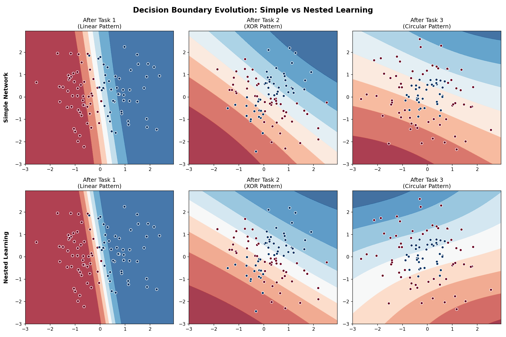
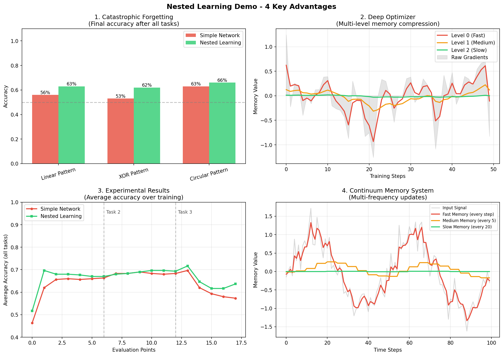

# Nested Learning Demo

Demo minh họa **Nested Learning** - một paradigm học tập mới từ Google Research cho Học Lồng Ghép.

## Paper gốc

- **Tên:** "Nested Learning: The Illusion of Deep Learning Architectures"
- **Hội nghị:** NeurIPS 2025
- **Tác giả:** Ali Behrouz, Meisam Razaviyayn, Peilin Zhong, Vahab Mirrokni (Google Research)
- **Blog:** <https://research.google/blog/introducing-nested-learning-a-new-ml-paradigm-for-continual-learning/>

## Nội dung

| File | Mô tả |
|------|-------|
| `nested_learning_demo.ipynb` | Notebook Colab với lý thuyết + code demo |
| `nested_learning_demo.py` | Script Python độc lập |
| `Nested Learning - Học Lồng Ghép.pdf` | Tài liệu Việt hóa |

## 4 Điểm mạnh chính

1. **Catastrophic Forgetting** - Giải quyết vấn đề quên kiến thức cũ khi học task mới
2. **Deep Optimizers** - Optimizer là memory module nén gradients
3. **Continuum Memory System** - Bộ nhớ đa tần suất (fast/medium/slow)
4. **Unified Architecture & Optimization** - Thống nhất kiến trúc và tối ưu hóa

## Kết quả Demo

### 1. Decision Boundaries (trực quan hóa vùng kiến thức)

So sánh khả năng ghi nhớ kiến thức cũ giữa mạng thường và Nested Learning qua các task liên tiếp.



### 2. Performance & Memory (hiệu năng và bộ nhớ)

Chi tiết về độ chính xác, hoạt động của Deep Optimizer và Continuum Memory System.



## Chạy demo

### Google Colab

Mở `nested_learning_demo.ipynb` trên Google Colab và chạy từng cell.

### Local

```bash
python3 -m venv venv
source venv/bin/activate
pip install numpy matplotlib
python nested_learning_demo.py
```

## Việt hóa

- Bùi Huỳnh Kinh Luân - <luanbhk@gmail.com>
